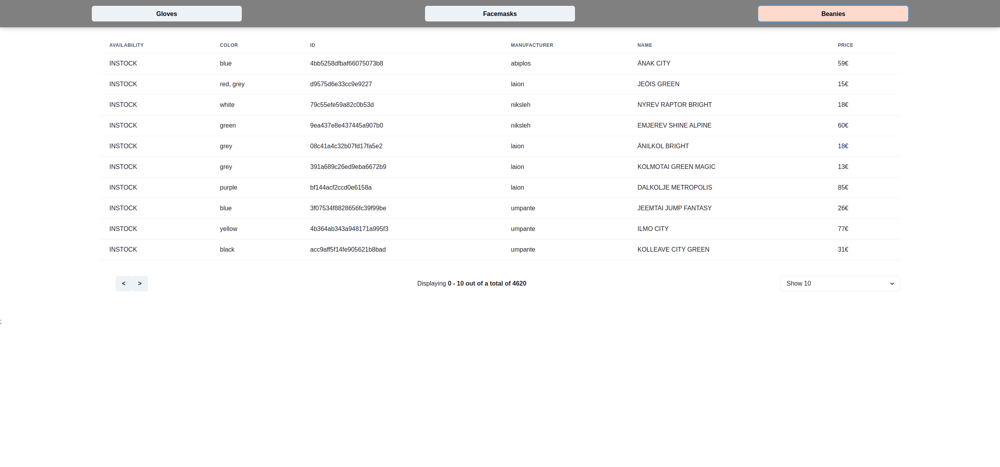

# Reaktor Junior Developer Assignment



This is my application to for the Reaktor Junior Developer Assignment 2021.

***Link to [DEMO](https://reaktor-webapp.vercel.app/)***

### Built With

- [Javascript](https://www.javascript.com/)
- [React](https://reactjs.org/)
- [Next.js](https://nextjs.org/)
- [Flask](https://flask.palletsprojects.com/en/1.1.x/)


The Demo is hosted on Vercel(frontend) and DigitalOcean(backend) severs.

The frontend is built with Next.js and the backend is built with Flask.

This project is made for the reaktor junior developer [assignment](https://www.reaktor.com/junior-dev-assignment/).

## Getting Started

To get a local copy up and running follow these simple steps. Make sure you have the latest version of Node.js and Python installed.

### Prerequisites

- Node.js
- npm
- python3
- pip

### Installation

To install and run locally please follow these steps

#### Frontend
1. Clone the repo
   ```sh
   https://github.com/LinuzJ/reaktor-webapp.git
   ```
2. Install NPM packages
   ```sh
   npm install
   ```
3. Set up .env.local
   ```sh
   touch .env.local
   ```
4. Open the .env.local file and copy this into it
   ```sh
   NEXT_PUBLIC_BACKEND_API=http://127.0.0.1:5000/
   ```
5. Then you can run the fronend!
   ```sh
   npm run dev
   ```
   
#### Backend
1. Open up a new window in the terminal an go into the backend directory
   ```sh
   cd flask-backend
   ```
2. Install pip requirements
   ```sh
   pip install -r requirements.txt
   ```
3. Then you can run the app!
   ```sh
   python app.py
   ```
**NOTE**: The initial fetching of data on the backend will take approximately 1 minute

Then you have everything up and running!
